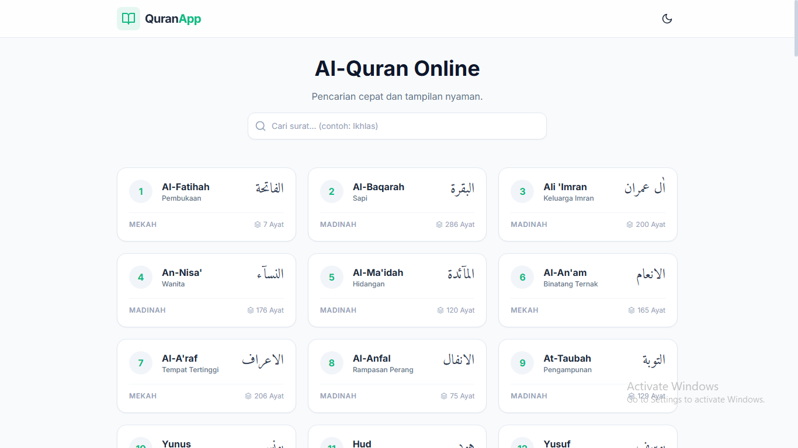

# 🕌 Al-Quran Online

Website Al-Quran Online yang memudahkan pengguna untuk membaca, memahami, dan mendengarkan ayat suci Al-Quran secara digital langsung dari browser.

🔗 Live Demo: [https://teman-hijrahmu.web.app/quran](https://teman-hijrahmu.web.app/quran)

---

## ✨ Fitur Utama

- 📖 Baca Al-Quran lengkap 30 Juz
- 🔍 Navigasi berdasarkan Surah & Ayat
- 🌐 Terjemahan Bahasa Indonesia
- 🔊 Audio murottal (per ayat / surah)
- ⚡ Cepat & ringan (web statis / frontend only)
- 📱 Responsive (mobile & desktop friendly)

Aplikasi Al-Quran online umumnya menyediakan teks, terjemahan, dan audio untuk membantu pembelajaran serta ibadah pengguna secara digital.

---

## 🖼️ Preview



---

## 🚀 Cara Menjalankan Project

### 1. Clone Repository
```bash
git clone https://github.com/Aghisna12/Al-Quran-Online.git
cd Al-Quran-Online
````

### 2. Jalankan di Browser

Cukup buka file `index.html` di browser:

```bash
open index.html
```

Atau gunakan Live Server (VSCode extension).

---

## 🛠️ Teknologi yang Digunakan

* HTML5
* CSS3
* JavaScript (Vanilla / Framework jika ada)
* API Al-Quran (untuk data surah, ayat, audio, dll)

---

## 📂 Struktur Folder (Contoh)

```
Al-Quran-Online/
└── index.html
```

---

## 🎯 Tujuan Project

Project ini dibuat untuk:

* Memudahkan akses membaca Al-Quran dimana saja
* Menjadi sarana belajar & ibadah digital
* Portofolio web development berbasis Islamic app

---

## 🤝 Kontribusi

Kontribusi sangat terbuka!

1. Fork repo ini
2. Buat branch baru (`feature/fitur-baru`)
3. Commit perubahan
4. Push & buat Pull Request

---

## 📜 Lisensi

Project ini bersifat open-source. Silakan digunakan, dikembangkan, dan dibagikan untuk kebaikan bersama 🤲

---

## 🙏 Dukungan

Jika project ini bermanfaat:

* ⭐ Star repository ini
* 🔁 Share ke teman / komunitas
* 🤝 Kontribusi fitur baru

---

## 📌 Author

Dibuat oleh: **Aghisna**
GitHub: [https://github.com/Aghisna12](https://github.com/Aghisna12)

---

*"Sebaik-baik kalian adalah yang belajar Al-Quran dan mengajarkannya."* 🤍
